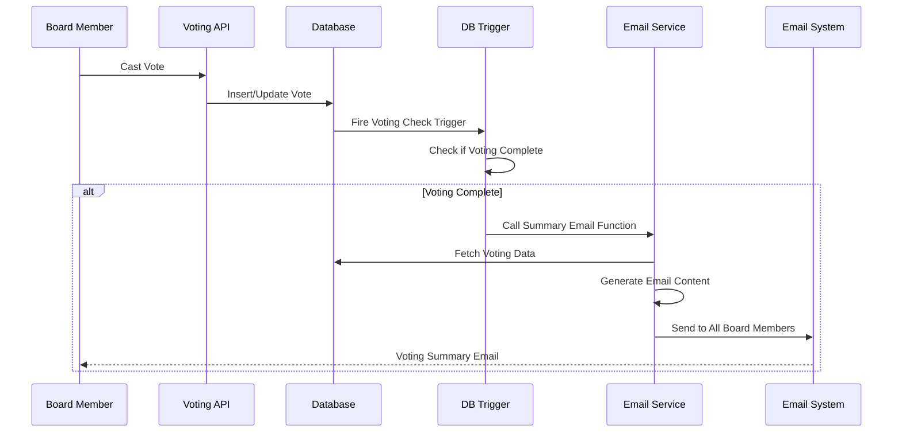

# Design Document

## Overview

The Voting Summary Email system will automatically send comprehensive voting reports to all board members when voting concludes on resolutions or minutes. The system integrates with the existing voting infrastructure and email notification service to provide immediate, detailed transparency about voting outcomes.

The design leverages database triggers and functions to detect voting completion, then uses the existing email service to send professionally formatted summary reports containing voter details, vote choices, comments, and statistical analysis.

## Architecture

### High-Level Flow



### Component Architecture

1. **Database Triggers**: Detect voting completion events
2. **Voting Completion Service**: Determine when voting ends and trigger emails
3. **Email Content Generator**: Create comprehensive voting summaries
4. **Email Delivery Service**: Send emails to all board members
5. **Audit Logger**: Track email delivery and system events

## Components and Interfaces

### 1. Database Trigger System

**Purpose**: Automatically detect when voting is complete and trigger email generation.

**Implementation**:
- Modify existing vote count update triggers for both `resolution_votes` and `minutes_votes`
- Add voting completion detection logic
- Call email service function when voting concludes

**Trigger Conditions**:
- All eligible voters have cast votes
- Voting deadline has been reached (handled by scheduled job)

### 2. Voting Summary Email Service

**Interface**:
```typescript
interface VotingSummaryEmailService {
  sendResolutionVotingSummary(resolutionId: string): Promise<boolean>;
  sendMinutesVotingSummary(minutesId: string): Promise<boolean>;
  generateVotingSummaryData(type: 'resolution' | 'minutes', id: string): Promise<VotingSummaryData>;
}

interface VotingSummaryData {
  item: Resolution | Minutes;
  votes: VoteWithProfile[];
  statistics: VotingStatistics;
  nonVoters: BoardMember[];
  outcome: VotingOutcome;
}

interface VotingStatistics {
  totalEligibleVoters: number;
  totalVotes: number;
  participationRate: number;
  approveVotes: number;
  rejectVotes: number;
  abstainVotes: number;
  approvalPercentage: number;
  isUnanimous: boolean;
  quorumMet: boolean;
  marginOfVictory: number;
  commentsCount: number;
}

interface VotingOutcome {
  passed: boolean;
  reason: string;
  finalStatus: string;
}
```

### 3. Email Template System

**Purpose**: Generate professional, comprehensive voting summary emails.

**Template Structure**:
- Header with item title and outcome
- Executive summary with key statistics
- Detailed voting breakdown by member
- Non-voter section
- Comments section (if any)
- Footer with system links

**Template Interface**:
```typescript
interface VotingSummaryEmailTemplate {
  generateSubject(item: Resolution | Minutes, outcome: VotingOutcome): string;
  generateHTML(data: VotingSummaryData): string;
  generateText(data: VotingSummaryData): string;
}
```

### 4. Scheduled Deadline Checker

**Purpose**: Handle voting deadline expiration for time-based voting closure.

**Implementation**:
- Cron job running every minute
- Check for expired voting deadlines
- Trigger summary emails for expired votes
- Update item status appropriately

### 5. Database Functions

**Voting Completion Detection**:
```sql
CREATE OR REPLACE FUNCTION check_voting_completion_and_send_summary()
RETURNS TRIGGER AS $$
BEGIN
    -- Check if all eligible voters have voted
    -- If so, call email summary function
    -- Update item status
    RETURN NEW;
END;
$$ LANGUAGE plpgsql;
```

**Email Summary Function**:
```sql
CREATE OR REPLACE FUNCTION send_voting_summary_email(
    item_type TEXT,
    item_id UUID
) RETURNS BOOLEAN AS $$
BEGIN
    -- Call Next.js API endpoint to trigger email
    -- Log the attempt
    RETURN TRUE;
END;
$$ LANGUAGE plpgsql;
```

## Data Models

### Extended Vote Models

```typescript
interface VoteWithProfile extends ResolutionVote | MinutesVote {
  voter: {
    id: string;
    full_name: string;
    email: string;
    position?: string;
  };
  votedAt: string;
  hasComments: boolean;
}

interface BoardMember {
  id: string;
  full_name: string;
  email: string;
  position?: string;
}
```

### Email Data Models

```typescript
interface VotingSummaryEmailData {
  recipients: BoardMember[];
  subject: string;
  htmlContent: string;
  textContent: string;
  metadata: {
    itemType: 'resolution' | 'minutes';
    itemId: string;
    votingEndedAt: string;
    triggerReason: 'all_voted' | 'deadline_expired';
  };
}
```

## Error Handling

### Email Delivery Failures

1. **Retry Logic**: Up to 3 attempts with exponential backoff
2. **Partial Failure Handling**: Continue sending to other recipients if some fail
3. **Fallback Notification**: Alert admins if bulk email fails
4. **Audit Logging**: Record all delivery attempts and outcomes

### Database Trigger Failures

1. **Error Logging**: Capture trigger execution errors
2. **Manual Trigger**: Admin interface to manually trigger summary emails
3. **Monitoring**: Alert system for trigger failures

### Data Consistency

1. **Transaction Safety**: Ensure vote updates and email triggers are atomic
2. **Duplicate Prevention**: Prevent multiple summary emails for same voting event
3. **Status Synchronization**: Ensure item status updates match email sending

## Testing Strategy

### Unit Tests

1. **Email Content Generation**: Test template rendering with various voting scenarios
2. **Voting Completion Detection**: Test trigger logic with different vote combinations
3. **Statistics Calculation**: Verify accuracy of voting statistics
4. **Error Handling**: Test retry logic and failure scenarios

### Integration Tests

1. **End-to-End Voting Flow**: Complete voting process with email delivery
2. **Database Trigger Testing**: Verify triggers fire correctly
3. **Email Service Integration**: Test with actual email service
4. **Deadline Expiration**: Test scheduled job functionality

### Test Scenarios

1. **All Members Vote**: Immediate email when last vote cast
2. **Deadline Expiration**: Email sent when deadline reached
3. **Partial Participation**: Email with non-voter section
4. **Unanimous Votes**: Special formatting for unanimous decisions
5. **Comments Present**: Email includes voter comments
6. **Email Failures**: Retry logic and error handling
7. **Mixed Vote Types**: Both resolution and minutes voting

### Performance Testing

1. **Large Board Size**: Test with many board members
2. **Concurrent Voting**: Multiple items voting simultaneously
3. **Email Volume**: Bulk email delivery performance
4. **Database Load**: Trigger performance under load

## Implementation Phases

### Phase 1: Core Infrastructure
- Database trigger modifications
- Basic email service integration
- Simple email templates

### Phase 2: Enhanced Features
- Comprehensive email templates
- Statistics calculation
- Non-voter tracking

### Phase 3: Advanced Features
- Scheduled deadline checking
- Advanced error handling
- Admin management interface

### Phase 4: Monitoring & Optimization
- Performance monitoring
- Email delivery analytics
- System optimization

## Security Considerations

### Data Privacy
- Email content includes sensitive voting information
- Ensure secure email transmission (TLS)
- Audit trail for email access

### Access Control
- Only board members receive voting summaries
- Admin controls for manual email triggers
- Secure API endpoints for email generation

### Email Security
- SPF/DKIM configuration for email authenticity
- Rate limiting for email sending
- Spam prevention measures

## Monitoring and Observability

### Metrics to Track
- Email delivery success rate
- Email generation time
- Voting completion detection accuracy
- User engagement with emails

### Logging Requirements
- All email sending attempts
- Voting completion events
- Error conditions and retries
- Performance metrics

### Alerting
- Failed email deliveries
- Database trigger failures
- Unusual voting patterns
- System performance issues