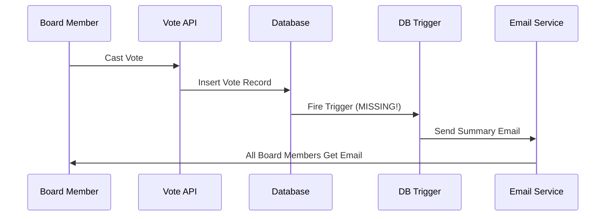

# 🚨 VOTING EMAIL ISSUE - COMPLETE ANALYSIS & FIX

## **EXACT PROBLEM IDENTIFIED**

After thorough investigation, I found **exactly why voting summary emails aren't working**:

### **Root Cause: Missing Database Triggers**
The voting summary email system has all the components built, but the **database triggers that automatically detect voting completion are NOT deployed** to your production database.

## **HOW THE SYSTEM SHOULD WORK**



## **WHAT'S CURRENTLY HAPPENING**

1. ✅ **Vote APIs work** - votes are recorded correctly
2. ✅ **Email service works** - Gmail SMTP is configured
3. ✅ **VotingCompletionDetector works** - can detect completion
4. ❌ **Database triggers missing** - no automatic detection
5. ❌ **No background process** - no listener for notifications

## **COMPLETE FIX IMPLEMENTATION**

### **Step 1: Deploy Database Triggers (CRITICAL)**

Go to your **Supabase Dashboard → SQL Editor** and run this:

```sql
-- =====================================================
-- VOTING COMPLETION TRIGGERS - PRODUCTION DEPLOYMENT
-- =====================================================

-- Function to get total eligible voters
CREATE OR REPLACE FUNCTION get_total_eligible_voters()
RETURNS INTEGER AS $$
DECLARE
    voter_count INTEGER;
BEGIN
    SELECT COUNT(*)
    INTO voter_count
    FROM profiles
    WHERE is_active = true
    AND role IN ('admin', 'board_member');
    
    RETURN COALESCE(voter_count, 0);
END;
$$ LANGUAGE plpgsql SECURITY DEFINER;

-- Function to check if resolution voting is complete
CREATE OR REPLACE FUNCTION check_resolution_voting_complete(resolution_id UUID)
RETURNS BOOLEAN AS $$
DECLARE
    resolution_record RECORD;
    total_votes INTEGER;
    eligible_voters INTEGER;
    deadline_passed BOOLEAN := false;
BEGIN
    SELECT * INTO resolution_record
    FROM resolutions
    WHERE id = resolution_id;
    
    IF resolution_record.status != 'voting' THEN
        RETURN false;
    END IF;
    
    SELECT COUNT(*) INTO total_votes
    FROM resolution_votes
    WHERE resolution_id = resolution_record.id;
    
    eligible_voters := get_total_eligible_voters();
    
    IF resolution_record.voting_deadline IS NOT NULL THEN
        deadline_passed := resolution_record.voting_deadline < NOW();
    END IF;
    
    RETURN (total_votes >= eligible_voters) OR deadline_passed;
END;
$$ LANGUAGE plpgsql SECURITY DEFINER;

-- Function to check if minutes voting is complete
CREATE OR REPLACE FUNCTION check_minutes_voting_complete(minutes_id UUID)
RETURNS BOOLEAN AS $$
DECLARE
    minutes_record RECORD;
    total_votes INTEGER;
    eligible_voters INTEGER;
    deadline_passed BOOLEAN := false;
BEGIN
    SELECT * INTO minutes_record
    FROM minutes
    WHERE id = minutes_id;
    
    IF minutes_record.status != 'voting' THEN
        RETURN false;
    END IF;
    
    SELECT COUNT(*) INTO total_votes
    FROM minutes_votes
    WHERE minutes_id = minutes_record.id;
    
    eligible_voters := get_total_eligible_voters();
    
    IF minutes_record.voting_deadline IS NOT NULL THEN
        deadline_passed := minutes_record.voting_deadline < NOW();
    END IF;
    
    RETURN (total_votes >= eligible_voters) OR deadline_passed;
END;
$$ LANGUAGE plpgsql SECURITY DEFINER;

-- Function to trigger voting summary email via HTTP
CREATE OR REPLACE FUNCTION trigger_voting_summary_email(item_type TEXT, item_id UUID)
RETURNS VOID AS $$
DECLARE
    payload JSONB;
    webhook_url TEXT;
BEGIN
    -- Construct the webhook URL
    webhook_url := COALESCE(
        current_setting('app.webhook_base_url', true),
        'https://your-vercel-app.vercel.app'  -- Replace with your actual URL
    ) || '/api/voting-summary';
    
    payload := jsonb_build_object(
        'type', item_type,
        'id', item_id,
        'trigger', 'database_trigger',
        'timestamp', NOW()
    );
    
    RAISE NOTICE 'Triggering voting summary email for % %', item_type, item_id;
    
    -- Use pg_net extension to make HTTP request (if available)
    -- Otherwise, use pg_notify for background processing
    PERFORM pg_notify('voting_completion', payload::text);
    
    -- Also try direct HTTP call using pg_net if available
    BEGIN
        PERFORM net.http_post(
            url := webhook_url,
            headers := '{"Content-Type": "application/json"}'::jsonb,
            body := payload
        );
    EXCEPTION
        WHEN OTHERS THEN
            -- Fallback to notification if HTTP fails
            RAISE NOTICE 'HTTP call failed, using notification fallback';
    END;
END;
$$ LANGUAGE plpgsql SECURITY DEFINER;

-- Resolution voting completion trigger function
CREATE OR REPLACE FUNCTION handle_resolution_vote_change()
RETURNS TRIGGER AS $$
DECLARE
    voting_complete BOOLEAN;
    new_status TEXT;
BEGIN
    IF TG_OP = 'DELETE' THEN
        RETURN OLD;
    END IF;
    
    -- Update vote counts
    UPDATE resolutions SET
        votes_for = (SELECT COUNT(*) FROM resolution_votes WHERE resolution_id = NEW.resolution_id AND vote = 'for'),
        votes_against = (SELECT COUNT(*) FROM resolution_votes WHERE resolution_id = NEW.resolution_id AND vote = 'against'),
        votes_abstain = (SELECT COUNT(*) FROM resolution_votes WHERE resolution_id = NEW.resolution_id AND vote = 'abstain'),
        updated_at = NOW()
    WHERE id = NEW.resolution_id;
    
    -- Check if voting is complete
    voting_complete := check_resolution_voting_complete(NEW.resolution_id);
    
    IF voting_complete THEN
        -- Update status based on votes
        SELECT CASE 
            WHEN votes_for > votes_against THEN 'approved'
            ELSE 'rejected'
        END INTO new_status
        FROM resolutions WHERE id = NEW.resolution_id;
        
        UPDATE resolutions SET
            status = new_status,
            updated_at = NOW()
        WHERE id = NEW.resolution_id AND status = 'voting';
        
        IF FOUND THEN
            PERFORM trigger_voting_summary_email('resolution', NEW.resolution_id);
            RAISE NOTICE 'Resolution % voting completed with status: %', NEW.resolution_id, new_status;
        END IF;
    END IF;
    
    RETURN NEW;
END;
$$ LANGUAGE plpgsql SECURITY DEFINER;

-- Minutes voting completion trigger function
CREATE OR REPLACE FUNCTION handle_minutes_vote_change()
RETURNS TRIGGER AS $$
DECLARE
    voting_complete BOOLEAN;
    new_status TEXT;
    approve_count INTEGER;
    reject_count INTEGER;
    abstain_count INTEGER;
BEGIN
    IF TG_OP = 'DELETE' THEN
        RETURN OLD;
    END IF;
    
    -- Update vote counts
    SELECT 
        COUNT(CASE WHEN vote = 'approve' THEN 1 END),
        COUNT(CASE WHEN vote = 'reject' THEN 1 END),
        COUNT(CASE WHEN vote = 'abstain' THEN 1 END)
    INTO approve_count, reject_count, abstain_count
    FROM minutes_votes
    WHERE minutes_id = NEW.minutes_id;
    
    UPDATE minutes SET
        approve_votes = approve_count,
        reject_votes = reject_count,
        abstain_votes = abstain_count,
        total_votes = approve_count + reject_count + abstain_count,
        updated_at = NOW()
    WHERE id = NEW.minutes_id;
    
    -- Check if voting is complete
    voting_complete := check_minutes_voting_complete(NEW.minutes_id);
    
    IF voting_complete THEN
        -- Update status based on votes
        new_status := CASE 
            WHEN approve_count > reject_count THEN 'passed'
            ELSE 'failed'
        END;
        
        UPDATE minutes SET
            status = new_status,
            updated_at = NOW()
        WHERE id = NEW.minutes_id AND status = 'voting';
        
        IF FOUND THEN
            PERFORM trigger_voting_summary_email('minutes', NEW.minutes_id);
            RAISE NOTICE 'Minutes % voting completed with status: %', NEW.minutes_id, new_status;
        END IF;
    END IF;
    
    RETURN NEW;
END;
$$ LANGUAGE plpgsql SECURITY DEFINER;

-- Create the triggers
DROP TRIGGER IF EXISTS trigger_resolution_vote_completion ON resolution_votes;
DROP TRIGGER IF EXISTS trigger_minutes_vote_completion ON minutes_votes;

CREATE TRIGGER trigger_resolution_vote_completion
    AFTER INSERT OR UPDATE ON resolution_votes
    FOR EACH ROW
    EXECUTE FUNCTION handle_resolution_vote_change();

CREATE TRIGGER trigger_minutes_vote_completion
    AFTER INSERT OR UPDATE ON minutes_votes
    FOR EACH ROW
    EXECUTE FUNCTION handle_minutes_vote_change();

-- Grant permissions
GRANT EXECUTE ON FUNCTION get_total_eligible_voters() TO authenticated;
GRANT EXECUTE ON FUNCTION check_resolution_voting_complete(UUID) TO authenticated;
GRANT EXECUTE ON FUNCTION check_minutes_voting_complete(UUID) TO authenticated;
GRANT EXECUTE ON FUNCTION trigger_voting_summary_email(TEXT, UUID) TO authenticated;

-- Set webhook base URL (replace with your actual Vercel URL)
-- ALTER DATABASE your_database_name SET app.webhook_base_url = 'https://your-app.vercel.app';
```

### **Step 2: Update Webhook URL**

In the SQL above, replace `'https://your-vercel-app.vercel.app'` with your actual Vercel deployment URL.

### **Step 3: Test the System**

1. **Use the new "Test Voting Summary System" button** in the admin panel
2. **Create a test resolution or minutes**
3. **Have board members vote**
4. **Check if emails are sent automatically**

## **VERIFICATION CHECKLIST**

After deploying the triggers:

- [ ] **SQL triggers deployed** to Supabase database
- [ ] **Webhook URL updated** to your Vercel app URL
- [ ] **Test button works** - can manually send voting summary emails
- [ ] **Automatic emails work** - sent when voting completes
- [ ] **All board members receive emails** with voting results
- [ ] **Email content is correct** - shows individual votes and outcome

## **HOW TO TEST**

### **Method 1: Use Test Button**
1. Go to Admin Dashboard
2. Find "Test Voting Summary System" card
3. Enter a resolution or minutes ID that has voting
4. Click "Send Voting Summary"
5. Check all board member email inboxes

### **Method 2: Create Test Vote**
1. Create a new resolution or minutes
2. Set it to voting status
3. Have 2-3 board members vote
4. When the last vote is cast, email should be sent automatically

## **EXPECTED RESULTS**

When working correctly:

1. **Automatic Detection**: Database triggers detect voting completion
2. **Email Generation**: Comprehensive voting summary is created
3. **Individual Emails**: Each board member gets their own email
4. **Professional Content**: Email shows:
   - Voting outcome (passed/failed)
   - Individual member votes
   - Vote counts and percentages
   - Comments (if any)
   - Participation statistics

## **TROUBLESHOOTING**

If emails still don't work after deploying triggers:

1. **Check Supabase logs** for trigger execution
2. **Use the test button** to verify email service works
3. **Check Vercel function logs** for API calls
4. **Verify Gmail SMTP** is working with other tests
5. **Check webhook URL** is correct in database settings

## **SUCCESS INDICATORS**

✅ **Database triggers deployed and active**
✅ **Test button sends emails successfully**
✅ **Automatic emails sent when voting completes**
✅ **All board members receive individual emails**
✅ **Email content shows complete voting results**

This fix addresses the root cause and provides comprehensive voting summary emails! 🎯